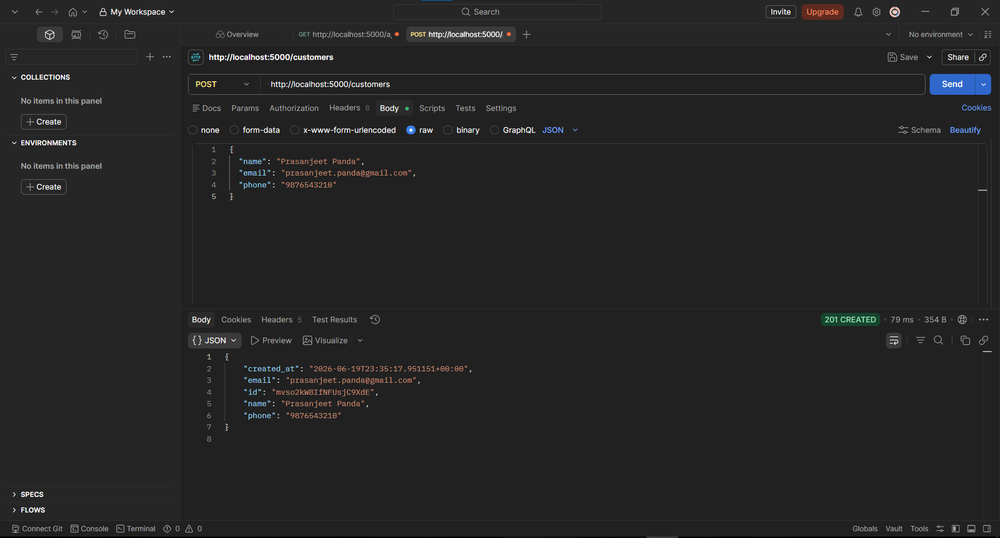
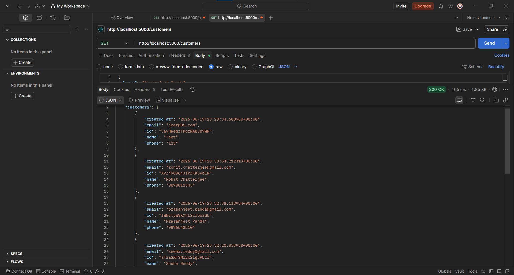
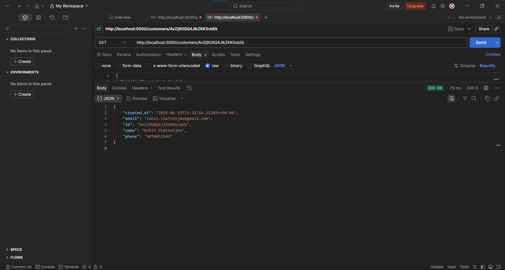
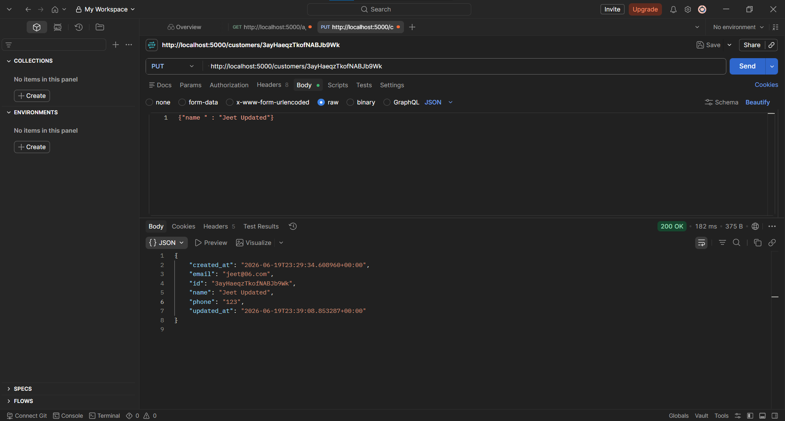
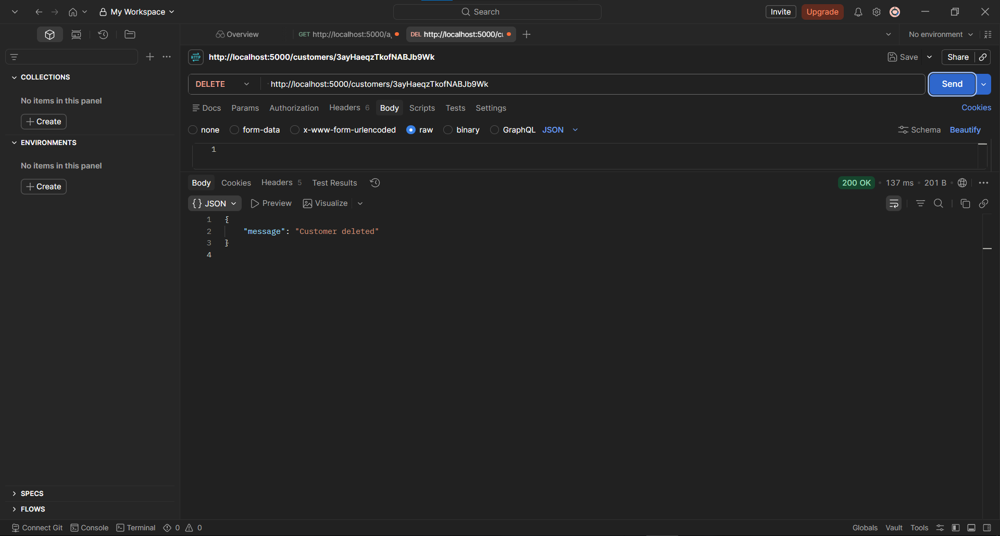

# Flask + Firebase Firestore — Customer CRUD API

A simple Flask REST API that performs full CRUD operations on a `Customer` collection in Firebase Firestore, with search and pagination support.

## Features

- Create a customer
- Fetch all customers (with search by email/name and pagination)
- Fetch a single customer by ID
- Update a customer
- Delete a customer

## Tech Stack

- Python
- Flask
- Firebase Firestore (via Firebase Admin SDK)

## Project Structure

```
flask-firestore-customers/
├── app.py
├── config/
│   └── firebase_config.py
├── routes/
│   └── customer_routes.py
├── models/
│   └── customer_model.py
├── requirements.txt
├── serviceAccountKey.json   # not committed
└── .gitignore
```

## Setup Instructions

1. **Clone the repository**
   ```bash
   git clone <your-repo-url>
   cd flask-firestore-customers
   ```

2. **Create and activate a virtual environment**
   ```bash
   python -m venv venv

   # Windows
   venv\Scripts\activate

   # Mac/Linux
   source venv/bin/activate
   ```

3. **Install dependencies**
   ```bash
   pip install -r requirements.txt
   ```

4. **Add your Firebase service account key**
   Place your `serviceAccountKey.json` file in the project root (see Firestore Configuration Steps below).

5. **Run the app**
   ```bash
   python app.py
   ```
   The server starts at `http://localhost:5000`.

## Firestore Configuration Steps

1. Go to the [Firebase Console](https://console.firebase.google.com/) and create a new project.
2. In the project, go to **Build → Firestore Database → Create database**, choose a region, and start in test mode.
3. Go to **Project Settings → Service accounts**, click **Generate new private key**, and download the JSON file.
4. Rename the downloaded file to `serviceAccountKey.json` and place it in the project root.
5. Add `serviceAccountKey.json` to `.gitignore` — never commit this file, it grants admin access to your database.

`config/firebase_config.py` initializes the connection:

```python
import firebase_admin
from firebase_admin import credentials, firestore

cred = credentials.Certificate("serviceAccountKey.json")
firebase_admin.initialize_app(cred)

db = firestore.client()
```

## API Documentation

Base URL: `http://localhost:5000`

### Create Customer

`POST /customers`

Request body:
```json
{
  "name": "Prasanjeet Panda",
  "email": "prasanjeet.panda@gmail.com",
  "phone": "9876543210"
}
```

Response: `201 Created`
```json
{
  "id": "mvso2kW8IfNFUsjC9XdE",
  "name": "Prasanjeet Panda",
  "email": "prasanjeet.panda@gmail.com",
  "phone": "9876543210",
  "created_at": "2026-06-19T23:35:17.951151+00:00"
}
```

**Screenshot — Create Customer**



---

### Get All Customers (with search + pagination)

`GET /customers`

Query parameters (all optional):
| Param | Description |
|---|---|
| `email` | Filter by exact email match |
| `name` | Filter by exact name match |
| `page_size` | Number of results per page (default: 10) |
| `start_after` | Document ID to start the next page after (cursor-based pagination) |

Example: `GET /customers?page_size=5`

Response: `200 OK`
```json
{
  "customers": [
    {
      "id": "3ayHaeqzTkofNABJb9Wk",
      "name": "Jeet",
      "email": "jeet@06.com",
      "phone": "123",
      "created_at": "2026-06-19T23:29:34.608960+00:00"
    }
  ],
  "next_start_after": "3ayHaeqzTkofNABJb9Wk"
}
```

**Screenshot — Get All Customers**



---

### Get Customer by ID

`GET /customers/<id>`

Response: `200 OK`
```json
{
  "id": "AvZj9O0Q4JlkZKK5vbEk",
  "name": "Rohit Chatterjee",
  "email": "rohit.chatterjee@gmail.com",
  "phone": "9870012345",
  "created_at": "2026-06-19T23:33:54.212419+00:00"
}
```

Response if not found: `404 Not Found`
```json
{ "error": "Customer not found" }
```

**Screenshot — Get Customer by ID**



---

### Update Customer

`PUT /customers/<id>`

Request body (only fields to update):
```json
{ "name": "Jeet Updated" }
```

Response: `200 OK`
```json
{
  "id": "3ayHaeqzTkofNABJb9Wk",
  "name": "Jeet Updated",
  "email": "jeet@06.com",
  "phone": "123",
  "created_at": "2026-06-19T23:29:34.608960+00:00",
  "updated_at": "2026-06-19T23:39:08.853287+00:00"
}
```

**Screenshot — Update Customer**



---

### Delete Customer

`DELETE /customers/<id>`

Response: `200 OK`
```json
{ "message": "Customer deleted" }
```

**Screenshot — Delete Customer**



---
